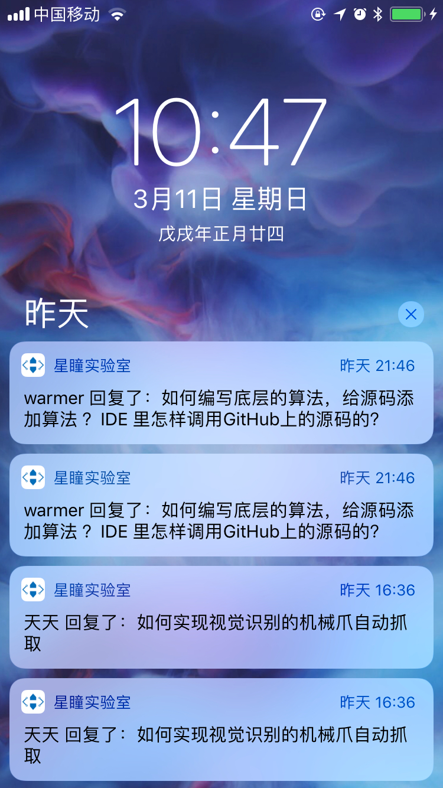
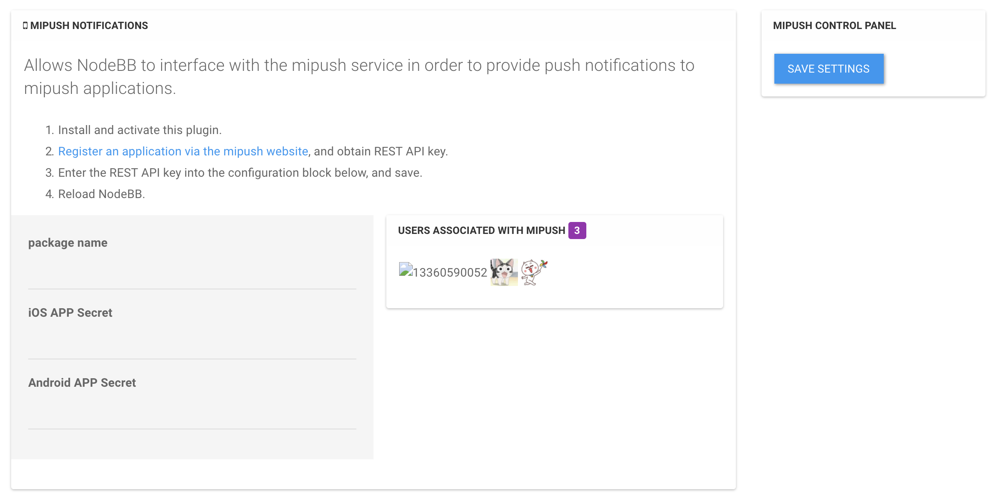
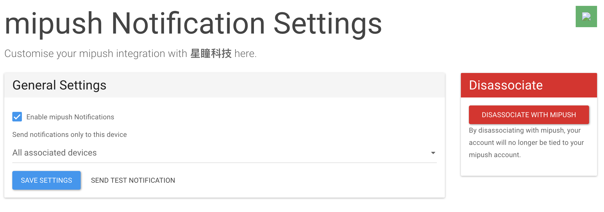
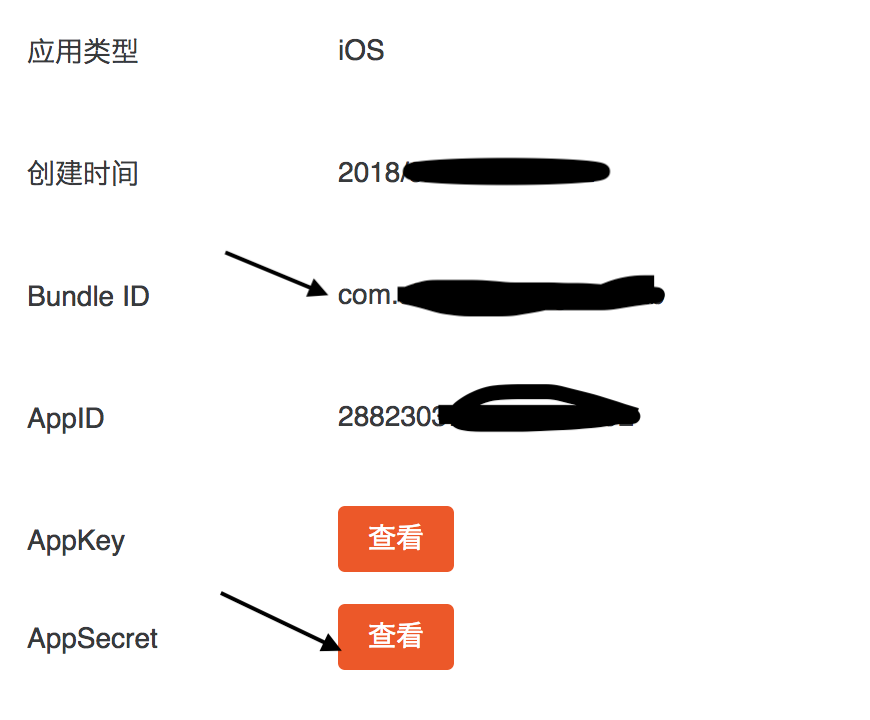
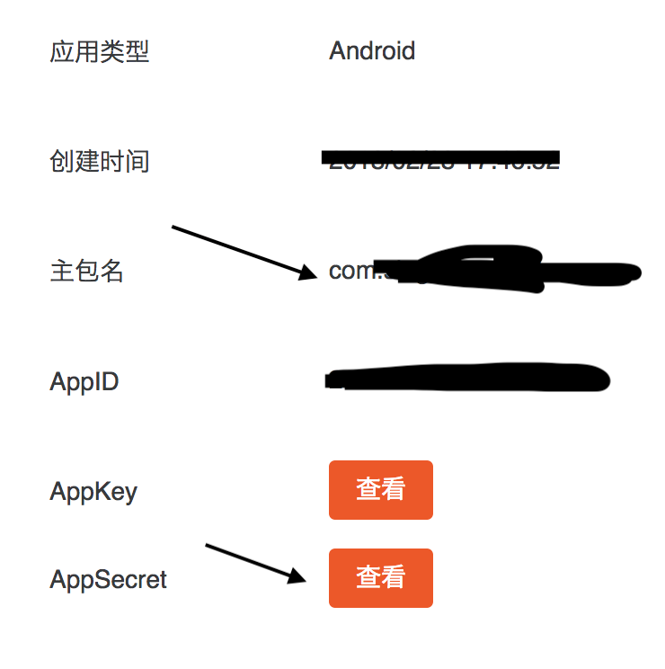

# mipush Notifications

forked from nodebb-plugin-pushbullet

Allows NodeBB to interface with the mipush service in order to provide push notifications to user mobile phones.

## Installation

    git clone https://github.com/kidswong999/nodebb-plugin-mipush

## Configuration

1. Install and activate this plugin.
1. [Register 2 applications (Android and iOS) via the mipush website](https://dev.mi.com/console/appservice/push.html), and obtain:

- package name
- iOS APP Secret
- Android APP Secret

3. Enter the info into the plugin's setup page (`/admin/mipush`), and save.
4. Reload NodeBB.

## Screenshots

